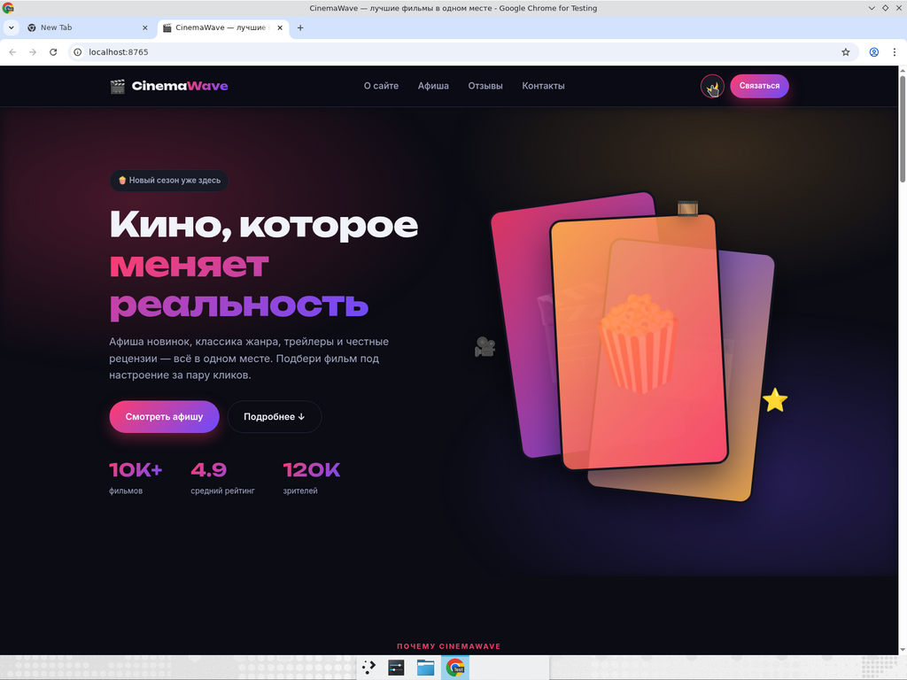
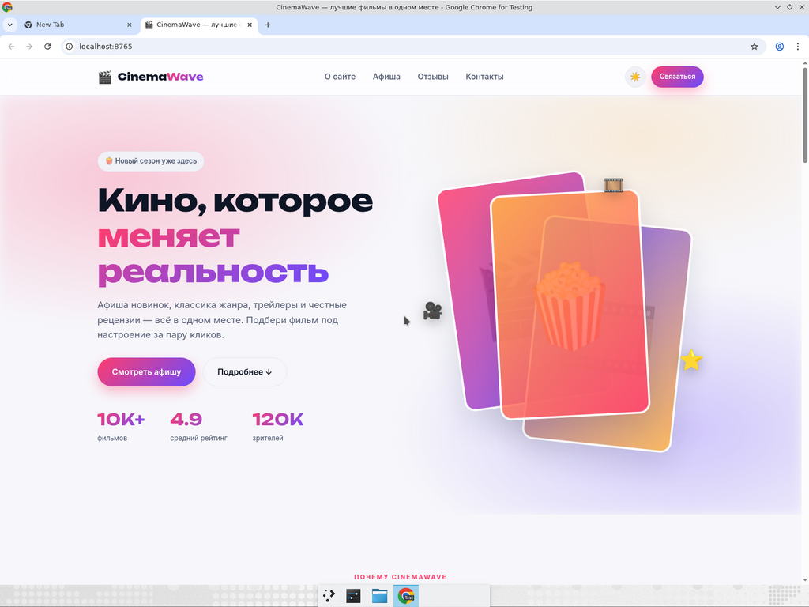
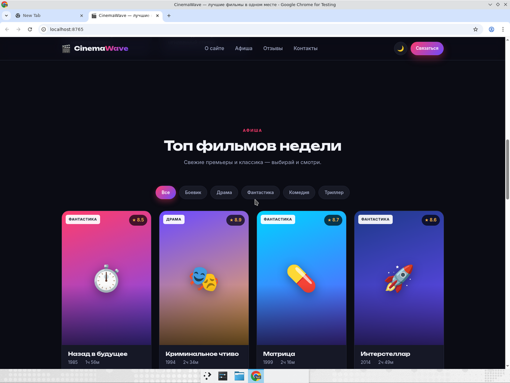
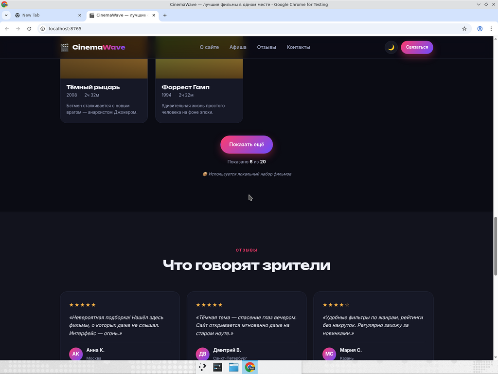
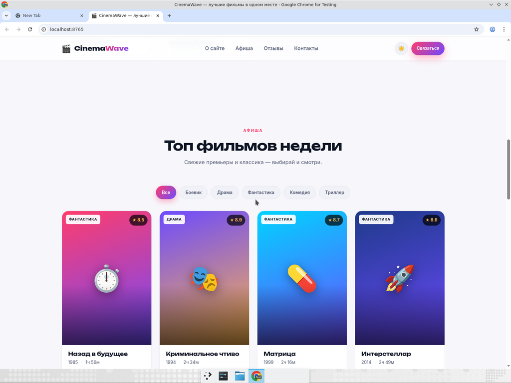
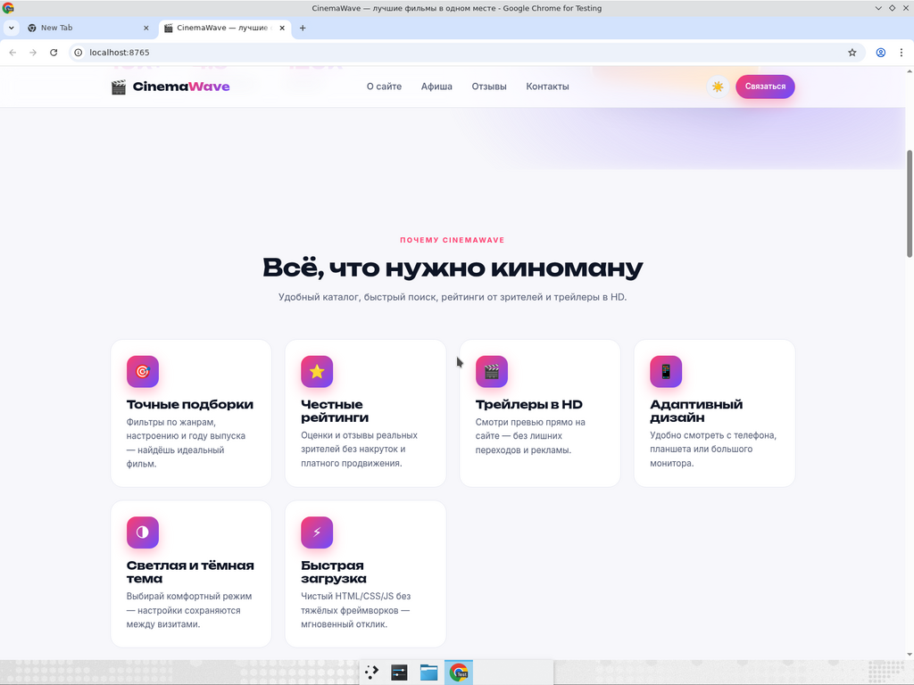
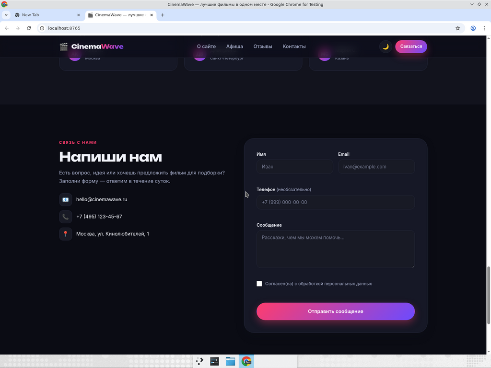
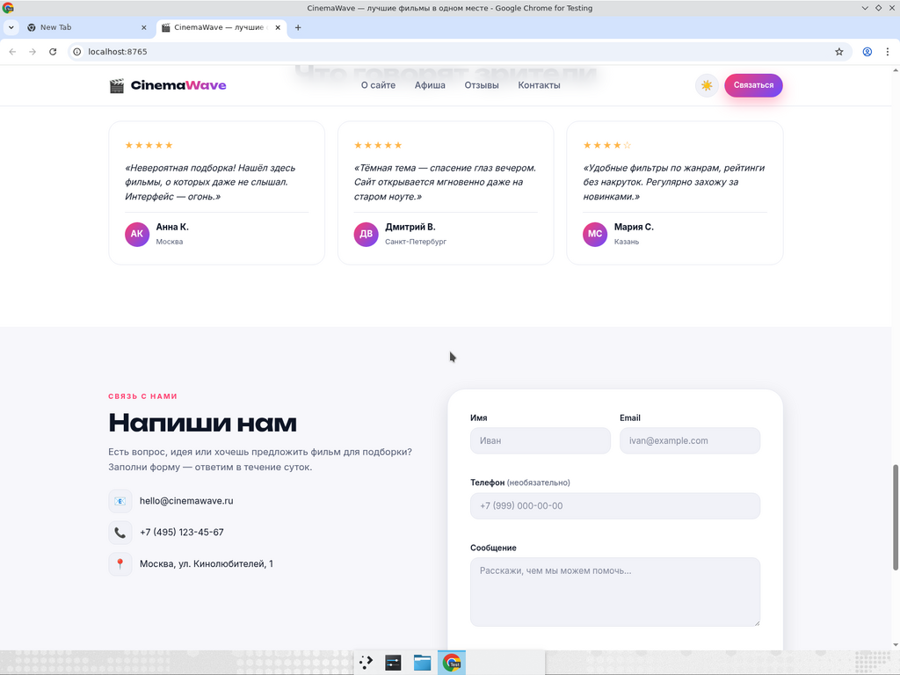
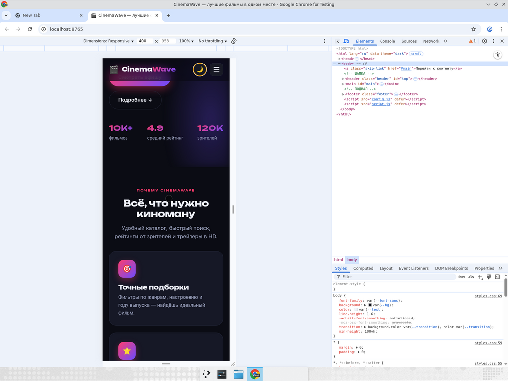
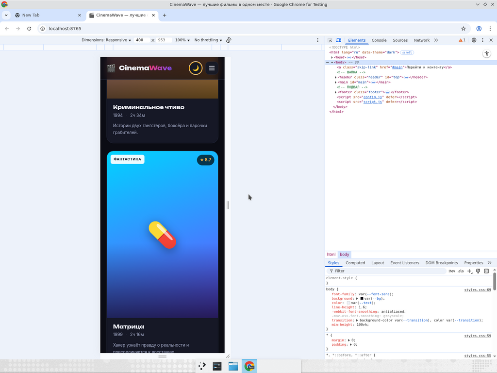

# 🎬 CinemaWave — киносайт-лендинг

Одностраничный сайт (лендинг) киноресурса, выполненный как **итоговый проект** по
курсу «HTML / CSS / JavaScript». Без фреймворков и сборщиков — чистый ванильный
стек, готовый к публикации на GitHub Pages.

> 🔗 **Живой сайт:** https://bildrussia.github.io/movie-landing/

---

## ✨ Возможности

- **Семантическая HTML-структура**: `header`, `nav`, `main`, `section`, `article`, `footer`, `form`.
- **Адаптивная вёрстка** на **CSS Grid** и **Flexbox** (десктоп / планшет / телефон).
- **Светлая и тёмная темы** с переключением и **сохранением выбора в `localStorage`** (учитывает системные настройки).
- **Каталог фильмов** с **20 фильмами**:
  - Фильтры по жанрам (боевик, драма, фантастика, комедия, триллер).
  - Кнопка **«Показать ещё»** — динамически добавляет новые карточки порциями по 6 штук.
  - Счётчик «показано X из Y».
- **Форма обратной связи** с **валидацией** (имя, email по regex, телефон, сообщение, согласие):
  - На `submit` данные выводятся в **`console.log`** в виде объекта.
  - Подсветка ошибок, live-валидация, успешный экран после отправки.
- **Мобильное меню** (бургер), плавная прокрутка по якорям.
- Анимации: плавающие постеры в hero, hover-эффекты, появление карточек.
- Доступность: `aria-label`, skip-link, поддержка клавиатурной навигации, `prefers-reduced-motion`.

---

## 🛠 Технологии

| Слой         | Что используется                                              |
|--------------|---------------------------------------------------------------|
| Разметка     | HTML5 (семантические теги)                                    |
| Стили        | CSS3 — Custom Properties, Grid, Flexbox, `@media`, анимации   |
| Логика       | JavaScript ES6+ (без зависимостей)                            |
| Шрифты       | Google Fonts — Inter + Unbounded                              |
| Хостинг      | GitHub Pages                                                  |

---

## 📁 Структура проекта

```
movie-landing/
├── index.html      # Разметка сайта
├── styles.css      # Все стили + темы + адаптив
├── script.js       # Тема, каталог, фильтры, форма, меню
├── README.md       # Этот файл
└── screenshots/    # Скриншоты для README
```

---

## 🚀 Запуск локально

Сайт полностью статический — никакой сборки не нужно.

```bash
# Способ 1: открыть index.html в браузере двойным кликом
open index.html        # macOS
xdg-open index.html    # Linux
start index.html       # Windows

# Способ 2: поднять локальный сервер (рекомендуется)
python3 -m http.server 8000
# затем открыть http://localhost:8000
```

---

## 🧪 Соответствие критериям задания

| Критерий                                                      | Реализация |
|---------------------------------------------------------------|------------|
| Семантическая HTML-структура (`header`, `main`, `footer`)     | ✅ `index.html` |
| Шапка с навигацией                                            | ✅ `.header`, `.nav` |
| Блок с карточками фильмов                                     | ✅ `.movies` (20 фильмов) |
| Форма обратной связи                                          | ✅ `#contactForm` |
| Использование Flexbox/Grid для сетки карточек                 | ✅ CSS Grid `.movies`, `.features__grid` |
| Кнопка «Показать ещё» (динамически добавляет карточки)        | ✅ `#loadMore` + `renderMovies()` |
| Переключение темы с сохранением в `localStorage`              | ✅ `#themeToggle` + ключ `cinemawave-theme` |
| Форма выводит данные в `console.log` при отправке             | ✅ `console.log("[CinemaWave] Данные формы:", data)` |
| Валидация полей формы (включая email)                         | ✅ regex-проверки + live-валидация |

Все необязательные пункты тоже реализованы: слайдер-постеры в hero,
hover-эффекты, фильтры по жанрам, мобильное меню, доступность.

---

## 📸 Скриншоты

### Главный экран

| Тёмная тема                                          | Светлая тема                                          |
|------------------------------------------------------|--------------------------------------------------------|
|       |       |

### Каталог фильмов и «Показать ещё»

| Каталог (тёмная тема)                                       | После «Показать ещё»                                          |
|--------------------------------------------------------------|----------------------------------------------------------------|
|         |             |

| Каталог (светлая тема)                                       | Преимущества (светлая тема)                                    |
|---------------------------------------------------------------|-----------------------------------------------------------------|
|        |              |

### Форма обратной связи (валидация + `console.log`)

| Тёмная тема                                       | Светлая тема                                       |
|---------------------------------------------------|----------------------------------------------------|
|    |   |

### Мобильная версия

| Hero / Преимущества                                  | Каталог                                              |
|------------------------------------------------------|-------------------------------------------------------|
|   |      |

---

## 📜 Лицензия

MIT — используй свободно как пример для своих учебных проектов.
